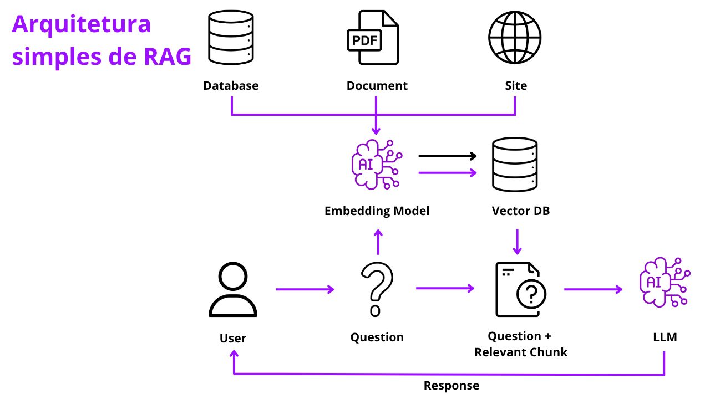

  
  
  
  
  
  
	
  
  
  

  

# Solução RAG

## ✒️ Descrição
O RAG, ou Retrieval Augmented Generation, é uma técnica que combina a recuperação de informações com a geração de respostas para melhorar a qualidade das respostas de um modelo de linguagem. Ao recuperar dados de diferentes fontes, como documentos e bancos de dados, o modelo consegue fornecer respostas mais precisas e atualizadas. Nesta aplicação desenvolvida, mostro um processo simplificado do uso dessa técnica utilizando um documento PDF.

## 🚀 Tecnologias utilizadas

 
  

## 📷 Demostração
Apresentação do esquema da aplicação.

  

## 🔥 Instalação
Clone o repositório.
~~~
git clone git@github.com:vian4dev/solucao-rag.git
~~~
Acesse o diretório do projeto.
~~~
cd solucao-rag/
~~~
Crie o arquivo .env na raiz do diretório.
~~~
OPENAI_API_KEY=""

⚠️ Será necessário gerar um token na OpenAI platform.
~~~
Instale as dependências.
~~~
pip install -r requirements.txt
~~~
Execute a aplicação no Jupyter Notebook ou VScode.
~~~
main.ipynb
~~~

## 📝 Licença
Esse projeto está sob a licença MIT. Veja o arquivo [LICENSE](LICENSE) para mais detalhes.

---

 
 
Desenvolvido por - <a href="https://github.com/vian4dev">Gabriel Viana</a> 🤖

 
  

